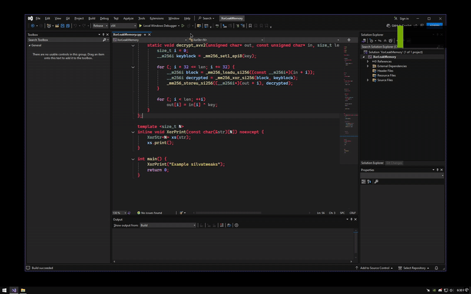

# XorNoLeakMemory

Ofuscação de strings em C++ usando XOR + AVX2 para evitar que elas fiquem expostas na memória.

---

## Como funciona

- A string fica armazenada **criptografada** usando XOR com uma chave fixa (0xAA).
- Quando precisar usar, ela é **descriptografada em tempo de execução**.
- Para acelerar, o código usa instruções AVX2 que processam 32 bytes de uma vez.
- Após o uso, a memória da string é **zerada** para não deixar rastros na RAM.

---

## Por que usar?

- Evita que strings sensíveis fiquem visíveis diretamente na memória.
- Dificulta engenharia reversa simples.
- Otimizado para desempenho com AVX2.

---

## Como usar

```cpp
int main() {
    XorPrint("Example silvatweaks"); // Exibe a string descriptografada na hora
    return 0;
}
``` 

---
## Preview


